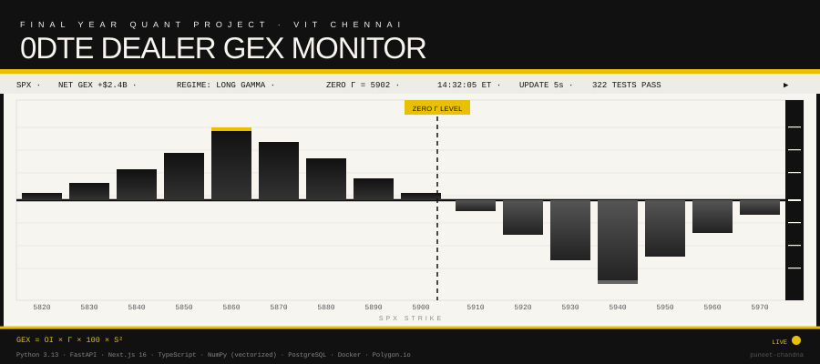

# 0DTE Dealer Gamma Exposure (GEX) Monitor

Real-time dashboard to monitor Dealer Gamma Exposure for 0DTE (zero-days-to-expiration) options on SPX.

**Goal:** Identify the "Zero Gamma Level" and "Net GEX" to predict intraday volatility regimes.



---

## Table of Contents
- [Features](#features)
- [Tech Stack](#tech-stack)
- [Quick Start](#quick-start)
- [Key Concepts](#key-concepts)
- [Tests](#tests)
- [Documentation](#documentation)
- [Deployment](#deployment)
- [Architecture Rules](#architecture-rules)
- [License](#license)

## ✨ Features

- **Real-time GEX Calculation** - Vectorized Black-Scholes Greeks (1000+ contracts in <1ms)
- **Zero Gamma Level** - Linear interpolation where cumulative GEX crosses zero
- **Market Regime Detection** - Short gamma (🔴) / Long gamma (🟢) / Neutral (🟡)
- **WebSocket Streaming** - Live updates every 5 seconds during market hours
- **Interactive Charts** - Strike-by-strike GEX visualization with Recharts
- **Historical Analysis** - Backtesting and volatility analysis tools

---

## 🔧 Tech Stack

| Layer         | Technology                                                          |
| ------------- | ------------------------------------------------------------------- |
| **Frontend**  | Next.js 16, TypeScript, TailwindCSS, React Query, Zustand, Recharts |
| **Backend**   | Python 3.13, FastAPI, NumPy (vectorized), SciPy, Pydantic v2        |
| **Database**  | PostgreSQL 16 (via Docker Compose / Railway)                        |
| **Real-time** | WebSocket                                                           |
| **Data**      | Polygon.io                                                          |

---

## 📁 Project Structure

```
odte-dealer-gamma/
├── backend/           # Python FastAPI server
│   ├── app/
│   │   ├── api/       # REST & WebSocket endpoints
│   │   ├── core/      # Greeks, GEX calculator, analytics
│   │   ├── models/    # Pydantic schemas
│   │   └── services/  # Background tasks, caching
│   └── tests/         # pytest (193 tests)
├── frontend/          # Next.js 16 app
│   └── src/
│       ├── app/       # App Router pages
│       ├── components/# UI & chart components
│       ├── hooks/     # React Query & WebSocket hooks
│       ├── lib/       # API client, utilities
│       └── test/      # Vitest (129 tests)
├── docs/              # Documentation
└── docker-compose.yml # PostgreSQL service
```

---

## 🚀 Quick Start

### Prerequisites

- Python 3.11+ (project uses 3.13)
- Node.js 20+ with pnpm
- Docker & Docker Compose

### 1. Clone and Setup

```bash
git clone https://github.com/<your-org>/odte-dealer-gamma.git
cd odte-dealer-gamma

# Copy environment files
cp backend/.env.example backend/.env
cp frontend/.env.example frontend/.env.local

# Add your Polygon.io API key to backend/.env
```

### Environment Variables (minimum)

Backend (`backend/.env`):
- `DATABASE_URL` (Postgres connection string)
- `HOST`, `PORT`
- `ENVIRONMENT` (development | staging | production)
- `CORS_ORIGINS` (JSON array string)

Frontend (`frontend/.env.local`):
- `NEXT_PUBLIC_API_URL=http://localhost:8000`
- `NEXT_PUBLIC_WS_URL=ws://localhost:8000/ws`

### 2. Start Database

```bash
docker compose up -d
```

### 3. Backend

```bash
cd backend
python -m venv .venv
source .venv/bin/activate  # Linux/Mac
pip install -r requirements.txt
uvicorn app.main:app --reload
```

API available at: http://localhost:8000/docs

### 4. Frontend

```bash
cd frontend
pnpm install
pnpm dev
```

Dashboard available at: http://localhost:3000

---

## 📊 Key Concepts

### GEX Formula

Black-Scholes Gamma (Γ) is computed with a dividend yield suitable for SPX (approximately `q ≈ 0.015`).

For each option contract `i`, the raw (magnitude) gamma exposure is:

```txt
raw_gex_i = OI_i × Γ_i × 100 × S²
```

Then the project applies the sign convention by option type:
- Calls contribute **negative** GEX
- Puts contribute **positive** GEX

| Symbol | Description                               |
| ------ | ----------------------------------------- |
| OI     | Open Interest                             |
| Γ      | Black-Scholes Gamma (with dividend yield) |
| 100    | Contract multiplier                       |
| S      | Spot price                                |

### Dealer Positioning

| Customer Action | Dealer Position | GEX Sign     |
| --------------- | --------------- | ------------ |
| Buy Calls       | Short Calls     | **Negative** |
| Buy Puts        | Sell Puts       | **Positive** |

**Net GEX = Σ(signed Put GEX) + Σ(signed Call GEX)** (calls are already signed negative).

### Market Regimes

| Regime         | Net GEX | Implication              |
| -------------- | ------- | ------------------------ |
| 🔴 Short Gamma | < -$1B  | High volatility expected |
| 🟢 Long Gamma  | > +$1B  | Low volatility expected  |
| 🟡 Neutral     | ±$1B    | Normal conditions        |

---

## 🧪 Tests

```bash
# Backend (193 tests)
cd backend && pytest -v

# Frontend (129 tests)
cd frontend && pnpm vitest run

# Type checking
cd backend && mypy app
cd frontend && pnpm tsc --noEmit
```

---

## 📖 Documentation

| Document                                | Description                         |
| --------------------------------------- | ----------------------------------- |
| [ARCHITECTURE.md](docs/ARCHITECTURE.md) | System design, data flow diagrams   |
| [API.md](docs/API.md)                   | Complete REST & WebSocket reference |
| [DEPLOYMENT.md](docs/DEPLOYMENT.md)     | Railway + Vercel deployment guide   |

---

## 🚀 Deployment

Deploy to Vercel (frontend) and Railway (backend):

```bash
# See detailed guide
docs/DEPLOYMENT.md
```

**Quick Links:**

- Backend: Railway auto-deploys from `backend/` folder
- Frontend: Vercel auto-deploys from `frontend/` folder

---

## 🏗️ Architecture Rules

1. **Vectorization** - All Greeks calculations use NumPy (no Python loops)
2. **State Management** - Server state in React Query, UI state in Zustand
3. **Type Safety** - Strict TypeScript, no `any` types
4. **Timezones** - All SPX data normalized to Eastern Time (ET)

---

## 📄 License

MIT

---

**Built with love for quantitative traders and market structure enthusiasts.**
