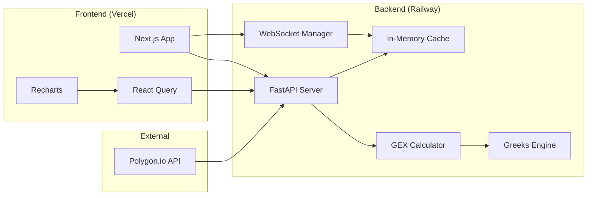
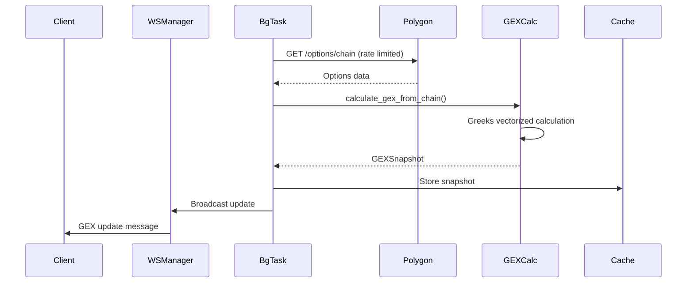
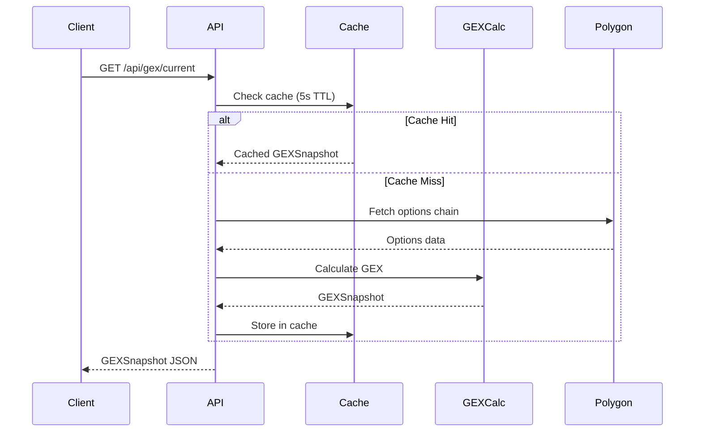

# Architecture

System design documentation for the 0DTE Dealer Gamma Exposure (GEX) Monitor.

## System Overview



## Component Architecture

### Backend (`/backend`)

| Component            | Path                           | Responsibility                        |
| -------------------- | ------------------------------ | ------------------------------------- |
| **FastAPI App**      | `app/main.py`                  | HTTP server, middleware, routing      |
| **Greeks Engine**    | `app/core/greeks.py`           | Vectorized Black-Scholes calculations |
| **GEX Calculator**   | `app/core/gex_calculator.py`   | GEX formula, zero gamma level         |
| **Data Acquisition** | `app/core/data_acquisition.py` | Polygon.io client with rate limiting  |
| **Analytics**        | `app/core/analytics.py`        | Backtesting, volatility analysis      |
| **WebSocket**        | `app/api/websocket.py`         | Real-time streaming to clients        |
| **Cache**            | `app/services/cache.py`        | TTL-based in-memory caching           |
| **Background Tasks** | `app/services/background.py`   | Scheduled data fetching               |

### Frontend (`/frontend`)

| Component             | Path                        | Responsibility              |
| --------------------- | --------------------------- | --------------------------- |
| **Dashboard**         | `src/app/dashboard/`        | Main visualization page     |
| **GEX Charts**        | `src/components/charts/`    | Bar chart, time series      |
| **UI Components**     | `src/components/ui/`        | Cards, badges, metrics      |
| **API Client**        | `src/lib/api.ts`            | Typed Axios client          |
| **React Query Hooks** | `src/hooks/useGEXData.ts`   | Data fetching, polling      |
| **WebSocket Hook**    | `src/hooks/useWebSocket.ts` | Real-time updates           |
| **UI Store**          | `src/stores/uiStore.ts`     | Client-only state (Zustand) |

---

## Data Flow

### Real-Time GEX Calculation



### REST API Request



---

## State Management

### Server State (React Query)

- All API responses cached and managed by React Query
- Automatic polling every 5 seconds during market hours
- Stale-while-revalidate pattern for instant UI

### Client State (Zustand)

Only UI preferences stored in Zustand:

```typescript
interface UIState {
  alertThreshold: number; // GEX alert threshold
  selectedExpiration: string; // Selected date filter
  isSidebarOpen: boolean; // Sidebar visibility
  theme: "light" | "dark"; // Theme preference
}
```

> **Rule**: Never store API responses in Zustand. React Query is the single source of truth for server state.

---

## GEX Calculation Logic

### Formula

```
GEX_i = OI_i × Γ_i × 100 × S²
```

Where:

- `OI` = Open Interest
- `Γ` = Black-Scholes Gamma (with dividend yield)
- `100` = Contract multiplier
- `S` = Spot price

### Dealer Sign Convention

| Customer Action | Dealer Position | GEX Sign     |
| --------------- | --------------- | ------------ |
| Buy Calls       | Short Calls     | **Negative** |
| Buy Puts        | Sell Puts       | **Positive** |

### Zero Gamma Level

Linear interpolation where cumulative GEX crosses zero:

```python
# Simplified algorithm
for i in range(len(strikes) - 1):
    if cum_gex[i] * cum_gex[i+1] < 0:  # Sign change
        # Linear interpolation between strikes
        zero_gamma = strikes[i] + (strikes[i+1] - strikes[i]) *
                     abs(cum_gex[i]) / (abs(cum_gex[i]) + abs(cum_gex[i+1]))
```

---

## Security

### API Keys

- All secrets in environment variables (`.env`)
- Never committed to version control
- Rotated quarterly (Polygon API key)

### CORS

- Development: `http://localhost:3000`
- Production: Explicit whitelist of domains

### Rate Limiting

- Polygon.io: 5 requests/minute (free tier)
- Internal `RateLimiter` class enforces limits

---

## Performance

### Vectorization

All Greeks calculations use NumPy vectorization:

```python
# ✅ Correct: Vectorized (processes 1000+ contracts in <1ms)
gamma = np.exp(-q * T) * norm.pdf(d1) / (S * sigma * np.sqrt(T))

# ❌ Wrong: Python loops (100x slower)
for i in range(len(contracts)):
    gamma[i] = calculate_single_gamma(contracts[i])
```

### Caching Strategy

| Data          | TTL | Invalidation    |
| ------------- | --- | --------------- |
| Current GEX   | 5s  | New calculation |
| Spot Price    | 1s  | Every tick      |
| Options Chain | 30s | Spot moves >1%  |

### Frontend Performance

- Charts wrapped in `React.memo()`
- Updates throttled to 200ms minimum
- Error boundaries prevent full-page crashes

---

## Deployment

```
┌─────────────────┐     ┌─────────────────┐
│    Vercel       │────▶│  Railway        │
│   (Frontend)    │     │  (Backend)      │
└─────────────────┘     └────────┬────────┘
                                 │
                        ┌────────▼────────┐
                        │   PostgreSQL    │
                        │   (Railway)     │
                        └─────────────────┘
```

See [DEPLOYMENT.md](./DEPLOYMENT.md) for setup instructions.
