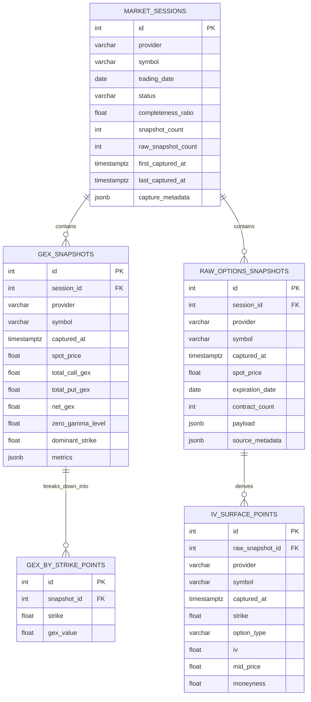

# PostgreSQL Schema

Database schema documentation for the historical persistence and replay layer.

## Overview

The PostgreSQL schema stores market captures at two levels:

- derived GEX snapshots used by the dashboard, analytics, and replay flows
- raw options-chain snapshots used for rebuilds, IV-surface analysis, and auditability

The schema is organized around a trading-day session record (`market_sessions`) and four child tables that hold time-series and strike-level detail.

## Source Of Truth

This document is based on:

- `backend/app/db/models.py`
- `backend/alembic/versions/20260323_0001_historical_persistence.py`
- `backend/app/services/historical_data.py`

## E-R Diagram

## Relationship Summary

| Parent table | Child table | Cardinality | Join key | Meaning |
| --- | --- | --- | --- | --- |
| `market_sessions` | `gex_snapshots` | 1 to many | `gex_snapshots.session_id` | All derived GEX captures for one provider, symbol, and trading day |
| `market_sessions` | `raw_options_snapshots` | 1 to many | `raw_options_snapshots.session_id` | All raw options-chain captures for one provider, symbol, and trading day |
| `gex_snapshots` | `gex_by_strike_points` | 1 to many | `gex_by_strike_points.snapshot_id` | Strike-level GEX decomposition for a single snapshot |
| `raw_options_snapshots` | `iv_surface_points` | 1 to many | `iv_surface_points.raw_snapshot_id` | Strike-level IV surface rows derived from a raw snapshot |

All foreign keys use `ON DELETE CASCADE`, so deleting a parent record removes its dependent rows automatically.

## Table Explanations

### `market_sessions`

Top-level session table for one `provider + symbol + trading_date` combination.

Important columns:

- `provider`, `symbol`, `trading_date`: natural business key for a market day
- `status`: session lifecycle, typically `in_progress` or `complete`
- `completeness_ratio`: estimated coverage of the regular trading session
- `snapshot_count`: number of derived GEX captures stored for the session
- `raw_snapshot_count`: number of raw options snapshots stored for the session
- `capture_metadata`: JSONB metadata such as storage version information
- `first_captured_at`, `last_captured_at`: session time bounds

Constraints and indexes:

- unique constraint on `(provider, symbol, trading_date)`
- index on `(trading_date, provider, symbol)`

### `gex_snapshots`

Stores the derived, application-facing GEX snapshot for one capture time. This is the main historical table used for replay, dashboard history, and analytics reads.

Important columns:

- `session_id`: foreign key to the owning market session
- `captured_at`: snapshot timestamp
- `spot_price`, `total_call_gex`, `total_put_gex`, `net_gex`
- `zero_gamma_level`, `dominant_strike`
- `metrics`: JSONB bag for derived analytics and replay-quality flags

Constraints and indexes:

- unique constraint on `(provider, symbol, captured_at)`
- index on `(provider, symbol, captured_at)`

### `gex_by_strike_points`

Child table that normalizes the per-strike GEX map out of a snapshot. Each row represents one strike within one `gex_snapshots` record.

Important columns:

- `snapshot_id`: foreign key to `gex_snapshots`
- `strike`: strike price
- `gex_value`: net GEX value at that strike

Constraints and indexes:

- index on `(snapshot_id, strike)`

### `raw_options_snapshots`

Stores a normalized raw options-chain payload captured from the provider. These snapshots are persisted less frequently than derived GEX snapshots and are used for replay rebuilds, validation, and IV-surface generation.

Important columns:

- `session_id`: foreign key to the owning market session
- `captured_at`: raw capture timestamp
- `spot_price`
- `expiration_date`: expiration inferred from the captured chain when available
- `contract_count`: number of contracts serialized into the payload
- `payload`: JSONB array of normalized option rows
- `source_metadata`: JSONB metadata describing the payload shape and storage format

Constraints and indexes:

- unique constraint on `(provider, symbol, captured_at)`
- index on `(provider, symbol, captured_at)`

### `iv_surface_points`

Stores one IV surface row per option contract derived from a raw snapshot. This makes IV and skew analysis queryable without re-reading the full JSON payload.

Important columns:

- `raw_snapshot_id`: foreign key to `raw_options_snapshots`
- `captured_at`
- `strike`
- `option_type`: usually `call` or `put`
- `iv`: implied volatility
- `mid_price`
- `moneyness`: normalized strike distance from spot

Constraints and indexes:

- index on `(provider, symbol, captured_at)`
- index on `(raw_snapshot_id, strike)`

## Capture And Replay Lifecycle

1. A live market capture creates or reuses one row in `market_sessions`.
2. The derived snapshot is written to `gex_snapshots`.
3. Its strike map is expanded into `gex_by_strike_points`.
4. At raw-capture intervals, the normalized options chain is stored in `raw_options_snapshots`.
5. The raw chain is exploded into `iv_surface_points` for IV-surface and skew analysis.
6. Session counters, first/last timestamps, completeness, and status are updated on `market_sessions`.

## Important Design Notes

### Derived vs raw storage

The schema intentionally keeps both:

- a compact derived representation in `gex_snapshots`
- a richer raw representation in `raw_options_snapshots`

This lets the application serve fast historical reads while still preserving enough source data to rebuild or re-score snapshots later.

### Logical pairing without a direct foreign key

There is no direct database foreign key from `gex_snapshots` to `raw_options_snapshots`.

Instead, the rebuild flow in `historical_data.py` logically matches them using the same session and capture timestamp context. In practice, the application aligns records by:

- `session_id`
- `provider`
- `symbol`
- `captured_at`

That design keeps the derived and raw pipelines decoupled while still allowing rebuilds from raw storage.

### PostgreSQL-specific JSON storage

The schema uses `JSONB` for:

- `market_sessions.capture_metadata`
- `gex_snapshots.metrics`
- `raw_options_snapshots.payload`
- `raw_options_snapshots.source_metadata`

This is a good fit because some parts of the stored payload are semi-structured and may evolve without requiring a table migration for every metadata addition.

## Recommended Read Patterns

- Use `market_sessions` to list available replay days per provider and symbol.
- Use `gex_snapshots` plus `gex_by_strike_points` for historical GEX charting and replay.
- Use `raw_options_snapshots` plus `iv_surface_points` for IV, skew, and rebuild workflows.
- Prefer the existing composite indexes when filtering by `provider`, `symbol`, and `captured_at`.
