# 0DTE Dealer Gamma Exposure (GEX) - Master Implementation Plan

## Project Overview

Build a research-grade, real-time dashboard to monitor Dealer Gamma Exposure (GEX) for SPX 0DTE options. The system will identify the "Zero Gamma Level" and "Net GEX" to predict intraday volatility regimes, providing traders with actionable market microstructure insights.

### Core Objectives

1. **Primary**: Real-time computation and visualization of Net GEX and Zero Gamma Level
2. **Secondary**: Historical GEX analysis and backtesting of volatility-based strategies
3. **Tertiary**: Signal generation for "Short Gamma" regimes (< -$1B)
4. **Output**: Production-ready dashboard deployable on Vercel + Railway/Render

---

## Technical Environment

| Layer        | Technology                                                    |
| ------------ | ------------------------------------------------------------- |
| **Frontend** | Next.js 16 (App Router), TypeScript, TailwindCSS, React Query |
| **Backend**  | Python 3.13, FastAPI, NumPy (vectorized), SciPy, Pydantic v2  |
| **Database** | PostgreSQL 16 (via Docker Compose)                            |
| **Realtime** | WebSocket (socket.io-client / native)                         |
| **Data**     | Polygon.io (real-time), CBOE (historical/fallback)            |
| **Testing**  | pytest (backend), Vitest (frontend)                           |

---

## Current Project Structure

```
odte-dealer-gamma/
├── backend/                      # Python FastAPI server
│   ├── app/
│   │   ├── api/                  # REST & WebSocket endpoints
│   │   │   ├── routes/           # Route handlers (gex, analytics, data)
│   │   │   └── websocket.py      # Real-time streaming
│   │   ├── core/                 # Business logic
│   │   │   ├── greeks.py         # Black-Scholes Greeks (vectorized)
│   │   │   ├── gex_calculator.py # GEX engine
│   │   │   ├── data_acquisition.py # Polygon.io client
│   │   │   └── analytics.py      # Backtesting, statistics
│   │   ├── models/               # Pydantic schemas
│   │   │   └── schemas.py
│   │   ├── services/             # Background tasks, caching
│   │   ├── config.py             # Environment config
│   │   └── main.py               # FastAPI app entry point
│   ├── tests/                    # pytest tests
│   └── requirements.txt
│
├── frontend/                     # Next.js 16 app
│   └── src/
│       ├── app/                  # App Router pages
│       │   ├── layout.tsx
│       │   ├── page.tsx
│       │   └── dashboard/
│       ├── components/           # UI components (charts, cards)
│       ├── hooks/                # React Query & WebSocket hooks
│       ├── lib/                  # API client, utilities
│       ├── stores/               # Zustand (UI state only)
│       ├── types/                # TypeScript interfaces
│       └── test/                 # Vitest tests
│
├── data/                         # Raw/processed data storage
├── notebooks/                    # Jupyter analysis notebooks
├── docs/                         # Documentation
└── docker-compose.yml            # PostgreSQL service
```

---

## Core Domain Logic (Immutable Mathematical Rules)

### A. Dealer Positioning Assumptions

| Customer Action | Dealer Action | Dealer Gamma Exposure |
| --------------- | ------------- | --------------------- |
| BUY Calls       | SELL Calls    | **SHORT Gamma** (−)   |
| BUY Puts        | SELL Puts     | **LONG Gamma** (+)    |

### B. The GEX Formula

For a single contract `i`:

```
raw_gex = OI_i × Γ_i × 100 × S²
```

- **OI**: Open Interest
- **Γ (Gamma)**: Black-Scholes Gamma (see formula below)
- **100**: Contract Multiplier (standard US options)
- **S**: Current Spot Price of Underlying (SPX)

### C. Dealer Sign Convention (CRITICAL)

> ⚠️ **This is the most common source of bugs. Get this right.**

```python
# Step 1: Calculate raw GEX (always positive)
raw_gex = OI × Γ × 100 × S²

# Step 2: Apply dealer sign based on who is short/long
if option_type == 'call':
    dealer_gex = -raw_gex  # Dealers SHORT calls → NEGATIVE exposure
else:  # put
    dealer_gex = +raw_gex  # Dealers LONG puts → POSITIVE exposure

# Step 3: Net GEX is simply the sum of all signed values
net_gex = sum(all_dealer_gex_values)  # Already includes signs!
```

**Interpretation:**

- **Net GEX < 0 (Short Gamma)**: Dealers must hedge by selling into drops, buying into rallies → **Amplifies moves**
- **Net GEX > 0 (Long Gamma)**: Dealers hedge by buying drops, selling rallies → **Dampens moves**

### D. Zero Gamma Level

The price level where **Net GEX = 0**.

- **Calculation**: Linear interpolation between strikes where cumulative GEX crosses zero
- **Significance**: Acts as intraday support/resistance pivot
- **Strike Spacing Awareness**: SPX has irregular strike intervals ($5 ATM, $10-25 OTM). Interpolation must handle non-uniform spacing.

---

## Implementation Phases

```
────────────────────────────────────────────────────────────────────────────
 Phase 1 │ Phase 2 │ Phase 3 │ Phase 4 │ Phase 5 │ Phase 6 │ Phase 7
────────────────────────────────────────────────────────────────────────────
 Backend │ Backend │ Frontend│ Frontend│ Connect │ Testing │ Deploy &
 Core    │ API     │ Core    │ Charts  │ & Real  │ & Polish│ Docs
────────────────────────────────────────────────────────────────────────────
 ~3 days │ ~2 days │ ~2 days │ ~3 days │ ~2 days │ ~3 days │ ~2 days
────────────────────────────────────────────────────────────────────────────
```

---

# Phase 1: Backend Core Engine

**Goal**: Implement the mathematical foundation with vectorized calculations.

## Stage 1.1: Greeks Engine (`backend/app/core/greeks.py`)

| File        | Purpose                  | Dependencies |
| ----------- | ------------------------ | ------------ |
| `greeks.py` | Vectorized Black-Scholes | numpy, scipy |

### Implementation Requirements

> ⚠️ **SPX pays dividends.** The standard Black-Scholes formula must include dividend yield `q`.

```python
# CORRECT: Vectorized calculation WITH dividend yield
def calculate_gamma(
    S: np.ndarray,      # Spot prices
    K: np.ndarray,      # Strike prices
    T: np.ndarray,      # Time to expiry (years)
    r: float,           # Risk-free rate (~0.05)
    q: float,           # Dividend yield (~0.015 for SPX)
    sigma: np.ndarray,  # Implied volatility
) -> np.ndarray:
    """Vectorized Gamma calculation - NO LOOPS"""
    # Handle edge cases
    T = np.maximum(T, 1e-10)  # Prevent T=0 division
    sigma = np.maximum(sigma, 1e-10)  # Prevent σ=0 division

    # d1 with dividend yield adjustment
    d1 = (np.log(S / K) + (r - q + 0.5 * sigma**2) * T) / (sigma * np.sqrt(T))

    # Gamma formula (same for calls and puts)
    gamma = np.exp(-q * T) * norm.pdf(d1) / (S * sigma * np.sqrt(T))

    # Handle NaN results
    gamma = np.nan_to_num(gamma, nan=0.0, posinf=0.0, neginf=0.0)

    return gamma

# INCORRECT: Do NOT do this
def calculate_gamma_slow(options_df):
    return [calculate_single_gamma(row) for row in options_df.iterrows()]  # ❌
```

### Key Functions to Implement

| Function                 | Formula                                               | Returns        |
| ------------------------ | ----------------------------------------------------- | -------------- |
| `calculate_d1()`         | `(ln(S/K) + (r - q + σ²/2)T) / (σ√T)`                 | `np.ndarray`   |
| `calculate_d2()`         | `d1 - σ√T`                                            | `np.ndarray`   |
| `calculate_delta()`      | `e^(-qT) × N(d1)` calls, `e^(-qT) × (N(d1) - 1)` puts | `np.ndarray`   |
| `calculate_gamma()`      | `e^(-qT) × N'(d1) / (Sσ√T)`                           | `np.ndarray`   |
| `calculate_vega()`       | `S × e^(-qT) × N'(d1) × √T`                           | `np.ndarray`   |
| `calculate_theta()`      | Complex formula (includes q terms)                    | `np.ndarray`   |
| `calculate_all_greeks()` | Compute all in one pass for efficiency                | `GreeksResult` |

### Constants

```python
# backend/app/core/constants.py
RISK_FREE_RATE = 0.05       # ~5% (update from Fed Funds rate)
SPX_DIVIDEND_YIELD = 0.015  # ~1.5% annual (update quarterly)
CONTRACT_MULTIPLIER = 100   # Standard US options
```

### Edge Cases to Handle

| Edge Case            | Detection         | Handling                          |
| -------------------- | ----------------- | --------------------------------- |
| `T = 0` (expiration) | `T <= 0`          | Return `gamma = 0`                |
| `IV = NaN`           | `np.isnan(sigma)` | Skip contract or use ATM IV       |
| `sigma = 0`          | `sigma <= 0`      | Set `sigma = 1e-10` (avoid div/0) |
| `IV > 500%`          | `sigma > 5.0`     | Flag as data error, skip          |
| `IV < 1%`            | `sigma < 0.01`    | Flag as suspicious, log warning   |
| `OI = 0`             | `OI == 0`         | Skip contract (no exposure)       |

---

## Stage 1.2: GEX Calculator (`backend/app/core/gex_calculator.py`)

| File                | Purpose                | Dependencies     |
| ------------------- | ---------------------- | ---------------- |
| `gex_calculator.py` | GEX computation engine | greeks.py, numpy |

### Core Class Structure

```python
class GEXCalculator:
    """Main GEX computation engine"""

    def calculate_contract_gex(
        self,
        open_interest: np.ndarray,
        gamma: np.ndarray,
        spot_price: float,
        option_type: np.ndarray,  # 'call' or 'put'
    ) -> np.ndarray:
        """
        GEX_i = OI_i × Γ_i × 100 × S²

        Returns: Signed GEX values (negative for calls, positive for puts)
        """
        pass

    def calculate_net_gex(
        self,
        call_gex: np.ndarray,
        put_gex: np.ndarray,
    ) -> float:
        """Net GEX = Σ(Put GEX) - Σ(Call GEX)"""
        pass

    def calculate_gex_by_strike(
        self,
        strikes: np.ndarray,
        gex_values: np.ndarray,
    ) -> Dict[float, float]:
        """Aggregate GEX per strike for the bar chart"""
        pass

    def find_zero_gamma_level(
        self,
        strikes: np.ndarray,
        cumulative_gex: np.ndarray,
    ) -> float:
        """
        Find where cumulative GEX crosses zero.
        Use linear interpolation between nearest strikes.
        """
        pass

    def calculate_gex_from_chain(
        self,
        options_df: pd.DataFrame,
        spot_price: float,
        current_time: datetime,
    ) -> GEXSnapshot:
        """Main entry point: full chain → GEXSnapshot"""
        pass
```

### Output Schema

```python
class GEXSnapshot(BaseModel):
    timestamp: datetime
    spot_price: float
    total_call_gex: float
    total_put_gex: float
    net_gex: float
    zero_gamma_level: float
    gex_by_strike: Dict[float, float]
    dominant_strike: float  # Strike with highest |GEX|
    metrics: Dict[str, float]  # Additional computed metrics
```

---

## Stage 1.3: Data Acquisition (`backend/app/core/data_acquisition.py`)

| File                  | Purpose               | Dependencies       |
| --------------------- | --------------------- | ------------------ |
| `data_acquisition.py` | Polygon.io API client | httpx, polygon-api |

### Key Methods

| Method                         | Purpose                                |
| ------------------------------ | -------------------------------------- |
| `get_options_chain_snapshot()` | Fetch full 0DTE options chain for SPX  |
| `get_spot_price()`             | Current SPX price                      |
| `get_historical_options()`     | Historical options data (date range)   |
| `filter_0dte_contracts()`      | Filter to today's expiration only      |
| `filter_strike_range()`        | Remove deep OTM strikes (±20% of spot) |
| `is_market_open()`             | Check if US market is currently open   |

### Market Hours Handling

> ⚠️ **0DTE is intraday only.** The system must handle market hours correctly.

```python
from datetime import datetime
from zoneinfo import ZoneInfo

ET = ZoneInfo('America/New_York')

def is_market_open() -> bool:
    """Check if US equity market is open (9:30 AM - 4:00 PM ET)"""
    now = datetime.now(ET)

    # Skip weekends
    if now.weekday() >= 5:  # Saturday=5, Sunday=6
        return False

    # Check market hours
    market_open = now.replace(hour=9, minute=30, second=0, microsecond=0)
    market_close = now.replace(hour=16, minute=0, second=0, microsecond=0)

    return market_open <= now <= market_close

def get_market_status() -> dict:
    """Get detailed market status for UI display"""
    now = datetime.now(ET)
    is_open = is_market_open()

    if now.weekday() >= 5:
        status = "closed_weekend"
        next_open = "Monday 9:30 AM ET"
    elif now.hour < 9 or (now.hour == 9 and now.minute < 30):
        status = "pre_market"
        next_open = "Today 9:30 AM ET"
    elif now.hour >= 16:
        status = "after_hours"
        next_open = "Tomorrow 9:30 AM ET"
    else:
        status = "open"
        next_open = None

    return {
        "is_open": is_open,
        "status": status,
        "next_open": next_open,
        "current_time_et": now.isoformat()
    }
```

### Polygon.io Rate Limiting

> ⚠️ **Polygon.io has strict rate limits.** Free tier: 5 requests/minute.

```python
import asyncio
from collections import deque
from time import time

class RateLimiter:
    """Token bucket rate limiter for API calls"""

    def __init__(self, calls_per_minute: int = 5):
        self.calls_per_minute = calls_per_minute
        self.min_interval = 60.0 / calls_per_minute  # seconds between calls
        self._call_times: deque[float] = deque(maxlen=calls_per_minute)

    async def acquire(self):
        """Wait if necessary to respect rate limit"""
        now = time()

        if len(self._call_times) >= self.calls_per_minute:
            oldest = self._call_times[0]
            wait_time = 60.0 - (now - oldest)
            if wait_time > 0:
                await asyncio.sleep(wait_time)

        self._call_times.append(time())

class PolygonClient:
    def __init__(self, api_key: str, tier: str = "free"):
        self.api_key = api_key
        self._rate_limiter = RateLimiter(
            calls_per_minute=5 if tier == "free" else 100
        )

    async def get_options_chain(self, symbol: str) -> dict:
        await self._rate_limiter.acquire()
        # ... make API call
```

### Data Flow

```
Polygon.io API
     │
     ├── Rate Limiter (5 req/min)
     ▼
┌─────────────────┐
│ Raw Options     │
│ Chain Data      │
└────────┬────────┘
         │ filter_0dte_contracts()
         ▼
┌─────────────────┐
│ Today's         │
│ Expiration Only │
└────────┬────────┘
         │ filter_strike_range(±20% of spot)
         ▼
┌─────────────────┐
│ Relevant        │
│ Strikes Only    │
└────────┬────────┘
         │ is_market_open() check
         │ enrich_with_greeks()
         ▼
┌─────────────────┐
│ Options + Greeks│
│ Ready for GEX   │
└─────────────────┘
```

### Fallback Data Sources

| Primary Source         | Fallback Source      | Trigger             |
| ---------------------- | -------------------- | ------------------- |
| Polygon.io (real-time) | CBOE delayed (15min) | Polygon API error   |
| Polygon.io spot price  | Yahoo Finance        | Rate limit exceeded |
| Live options chain     | Cached snapshot      | Market closed       |

---

## Stage 1.4: Analytics Engine (`backend/app/core/analytics.py`)

| File           | Purpose                 | Dependencies       |
| -------------- | ----------------------- | ------------------ |
| `analytics.py` | Backtesting, statistics | scipy.stats, numpy |

### Key Functions

```python
class VolatilityAnalyzer:
    @staticmethod
    def analyze_gex_volatility_relationship(
        gex_data: pd.DataFrame,
        price_data: pd.DataFrame,
    ) -> AnalyticsResult:
        """
        Hypothesis Test:
        H0: Mean RV when GEX < -1B equals Mean RV when GEX > 0
        H1: Mean RV when GEX < -1B > Mean RV when GEX > 0

        Uses Welch's t-test for unequal variances
        """
        pass

class TradingStrategy:
    @staticmethod
    def volatility_breakout_strategy(
        gex_data: pd.DataFrame,
        price_data: pd.DataFrame,
        entry_threshold: float = -1e9,
    ) -> BacktestResult:
        """
        Strategy: Enter long volatility when Net GEX < threshold
        Calculate:
        - Win rate
        - Average return
        - Sharpe ratio
        - Max drawdown
        """
        pass
```

---

# Phase 2: Backend API Layer

**Goal**: Expose the core engine via REST and WebSocket endpoints.

## Stage 2.1: Pydantic Schemas (`backend/app/models/schemas.py`)

### Request/Response Models

```python
# Existing base models + additions
class GEXCurrentRequest(BaseModel):
    symbol: str = "SPX"
    include_greeks: bool = True

class GEXHistoricalRequest(BaseModel):
    start_date: date
    end_date: date
    interval: Literal["5m", "15m", "1h", "1d"] = "1h"

class RegimeResponse(BaseModel):
    regime: Literal["short_gamma", "long_gamma", "neutral"]
    description: str
    color: Literal["red", "green", "yellow"]
    net_gex: float
    net_gex_billions: float
    timestamp: datetime
```

---

## Stage 2.2: GEX Routes (`backend/app/api/routes/gex.py`)

| Endpoint              | Method | Purpose                        |
| --------------------- | ------ | ------------------------------ |
| `/api/gex/current`    | GET    | Current real-time GEX snapshot |
| `/api/gex/historical` | GET    | Historical GEX for date range  |
| `/api/gex/strikes`    | GET    | GEX breakdown by strike        |
| `/api/gex/regime`     | GET    | Current market regime          |

---

## Stage 2.3: Analytics Routes (`backend/app/api/routes/analytics.py`)

| Endpoint                            | Method | Purpose                   |
| ----------------------------------- | ------ | ------------------------- |
| `/api/analytics/gex-volatility`     | GET    | GEX↔Volatility analysis   |
| `/api/analytics/backtest`           | GET    | Strategy backtesting      |
| `/api/analytics/summary-statistics` | GET    | Historical GEX statistics |

---

## Stage 2.4: WebSocket Streaming (`backend/app/api/websocket.py`)

```python
@router.websocket("/ws/gex-stream")
async def websocket_gex_stream(websocket: WebSocket):
    """
    Real-time GEX streaming

    Message Format:
    {
        "type": "gex_update",
        "data": {
            "net_gex": -1234567890,
            "zero_gamma_level": 5950.25,
            "spot_price": 5945.50,
            "regime": "short_gamma"
        },
        "timestamp": "2024-01-15T10:30:00-05:00"
    }

    Update Frequency: Every 5 seconds during market hours
    """
    pass
```

---

## Stage 2.5: Background Services (`backend/app/services/`)

| File            | Purpose                                |
| --------------- | -------------------------------------- |
| `background.py` | Scheduled data fetching, cache warming |
| `cache.py`      | Redis/in-memory caching layer          |

### Caching Strategy

```python
# backend/app/services/cache.py
from functools import lru_cache
from datetime import datetime, timedelta

class GEXCache:
    """In-memory cache with TTL for GEX snapshots"""

    def __init__(self):
        self._cache: dict[str, tuple[datetime, Any]] = {}
        self._ttl = timedelta(seconds=5)  # 5s during market hours
        self._stale_ttl = timedelta(hours=1)  # 1h for stale data

    def get(self, key: str) -> Optional[Any]:
        if key not in self._cache:
            return None

        stored_at, data = self._cache[key]
        age = datetime.now() - stored_at

        if age > self._stale_ttl:
            del self._cache[key]
            return None

        return data

    def set(self, key: str, data: Any):
        self._cache[key] = (datetime.now(), data)

    def is_stale(self, key: str) -> bool:
        if key not in self._cache:
            return True
        stored_at, _ = self._cache[key]
        return (datetime.now() - stored_at) > self._ttl

    def invalidate_on_spot_move(self, old_spot: float, new_spot: float):
        """Invalidate cache if spot price moves >1%"""
        if abs(new_spot - old_spot) / old_spot > 0.01:
            self._cache.clear()
```

### Cache Keys

| Key Pattern            | TTL  | Invalidation Trigger |
| ---------------------- | ---- | -------------------- |
| `gex:current`          | 5s   | New calculation      |
| `gex:strikes:{date}`   | 5s   | New calculation      |
| `spot:price`           | 1s   | Every tick           |
| `options:chain:{date}` | 30s  | Spot moves >1%       |
| `analytics:summary`    | 5min | End of day           |

---

# Phase 3: Frontend Core

**Goal**: Set up the Next.js application shell with routing and data fetching.

## Stage 3.1: Types (`frontend/src/types/index.ts`)

```typescript
// Mirror Pydantic schemas
export interface GEXSnapshot {
  timestamp: string;
  spot_price: number;
  total_call_gex: number;
  total_put_gex: number;
  net_gex: number;
  zero_gamma_level: number;
  gex_by_strike: Record<number, number>;
  dominant_strike: number;
  metrics: Record<string, number>;
}

export interface RegimeData {
  regime: "short_gamma" | "long_gamma" | "neutral";
  description: string;
  color: "red" | "green" | "yellow";
  net_gex: number;
  net_gex_billions: number;
  timestamp: string;
}

export interface GEXByStrike {
  strikes: number[];
  gex_values: number[];
  spot_price: number;
  zero_gamma_level: number;
}
```

---

## Stage 3.2: API Client (`frontend/src/lib/api.ts`)

```typescript
import axios from "axios";

const API_BASE_URL = process.env.NEXT_PUBLIC_API_URL || "http://localhost:8000";

const apiClient = axios.create({
  baseURL: API_BASE_URL,
  headers: { "Content-Type": "application/json" },
});

export const gexAPI = {
  getCurrentGEX: () => apiClient.get<GEXSnapshot>("/api/gex/current"),
  getGEXByStrikes: () => apiClient.get<GEXByStrike>("/api/gex/strikes"),
  getCurrentRegime: () => apiClient.get<RegimeData>("/api/gex/regime"),
  getHistoricalGEX: (startDate: string, endDate: string) =>
    apiClient.get("/api/gex/historical", {
      params: { start_date: startDate, end_date: endDate },
    }),
};
```

---

## Stage 3.3: React Query Hooks (`frontend/src/hooks/useGEXData.ts`)

```typescript
import { useQuery } from "@tanstack/react-query";
import { gexAPI } from "@/lib/api";

export function useCurrentGEX() {
  return useQuery({
    queryKey: ["gex", "current"],
    queryFn: gexAPI.getCurrentGEX,
    refetchInterval: 5000, // Poll every 5 seconds
    staleTime: 3000,
  });
}

export function useGEXByStrikes() {
  return useQuery({
    queryKey: ["gex", "strikes"],
    queryFn: gexAPI.getGEXByStrikes,
    refetchInterval: 5000,
    staleTime: 3000,
  });
}

export function useCurrentRegime() {
  return useQuery({
    queryKey: ["gex", "regime"],
    queryFn: gexAPI.getCurrentRegime,
    refetchInterval: 5000,
    staleTime: 3000,
  });
}
```

---

## Stage 3.4: WebSocket Hook (`frontend/src/hooks/useWebSocket.ts`)

```typescript
export function useGEXStream() {
  const [gexData, setGEXData] = useState<GEXSnapshot | null>(null);
  const [isConnected, setIsConnected] = useState(false);

  useEffect(() => {
    const ws = new WebSocket(`${WS_BASE_URL}/ws/gex-stream`);

    ws.onopen = () => setIsConnected(true);
    ws.onclose = () => setIsConnected(false);
    ws.onmessage = (event) => {
      const message = JSON.parse(event.data);
      if (message.type === "gex_update") {
        setGEXData(message.data);
      }
    };

    return () => ws.close();
  }, []);

  return { gexData, isConnected };
}
```

---

## Stage 3.5: Zustand Store (`frontend/src/stores/uiStore.ts`)

> **Rule**: Zustand is for CLIENT STATE ONLY (UI settings). Never store API responses here.

```typescript
import { create } from "zustand";

interface UIState {
  alertThreshold: number;
  selectedExpiration: string | null;
  isSidebarOpen: boolean;
  theme: "light" | "dark";

  // Actions
  setAlertThreshold: (value: number) => void;
  setSelectedExpiration: (date: string | null) => void;
  toggleSidebar: () => void;
  setTheme: (theme: "light" | "dark") => void;
}

export const useUIStore = create<UIState>((set) => ({
  alertThreshold: -1e9,
  selectedExpiration: null,
  isSidebarOpen: true,
  theme: "dark",

  setAlertThreshold: (value) => set({ alertThreshold: value }),
  setSelectedExpiration: (date) => set({ selectedExpiration: date }),
  toggleSidebar: () =>
    set((state) => ({ isSidebarOpen: !state.isSidebarOpen })),
  setTheme: (theme) => set({ theme }),
}));
```

---

# Phase 4: Frontend Charts & Components

**Goal**: Build the visualization layer with high-performance charts.

## Stage 4.1: UI Components (`frontend/src/components/ui/`)

| Component         | Purpose                           |
| ----------------- | --------------------------------- |
| `MetricCard.tsx`  | Display single metric with trend  |
| `AlertBanner.tsx` | Regime alerts (Short Gamma, etc.) |
| `Card.tsx`        | Generic card wrapper              |
| `Badge.tsx`       | Status badges                     |
| `Skeleton.tsx`    | Loading states                    |

---

## Stage 4.2: Chart Components (`frontend/src/components/charts/`)

### GEX Bar Chart (Primary Visualization)

| Component             | Purpose                          |
| --------------------- | -------------------------------- |
| `GEXBarChart.tsx`     | Strike-by-strike GEX bars        |
| `TimeSeriesChart.tsx` | Historical Net GEX over time     |
| `RegimeIndicator.tsx` | Visual regime status             |
| `ZeroGammaLine.tsx`   | Overlay showing Zero Gamma Level |

### Chart Specifications

```typescript
// GEXBarChart.tsx
// - Red bars: Negative GEX (Calls)
// - Green bars: Positive GEX (Puts)
// - Vertical line: Current spot price
// - Dashed line: Zero Gamma Level

interface GEXBarChartProps {
  data: { strike: number; gex: number }[];
  spotPrice: number;
  zeroGammaLevel: number;
}
```

### Performance Requirements

1. **Memoization**: Use `React.memo()` for chart components
2. **Granular updates**: Only re-render changed data points
3. **Throttling**: Debounce rapid updates (max 1 render per 200ms)

---

## Stage 4.3: Dashboard Layout (`frontend/src/app/dashboard/page.tsx`)

```
┌─────────────────────────────────────────────────────────────────────────┐
│ Header: Logo | "0DTE GEX Monitor" | Theme Toggle | Settings             │
├─────────────────────────────────────────────────────────────────────────┤
│ Regime Banner: [SHORT GAMMA - High Volatility Expected]                 │
├─────────────┬───────────────────────────────────────────────────────────┤
│ Sidebar     │ Main Content                                              │
│             │                                                           │
│ Quick Stats │ ┌─────────────────────────────────────────────────────┐   │
│ • Net GEX   │ │ GEX by Strike Bar Chart                             │   │
│ • Zero Γ    │ │                                                     │   │
│ • Spot      │ │  ████   ████████████  ▼ Spot Price                  │   │
│ • Regime    │ │  ████   ████████████  ---- Zero Gamma               │   │
│             │ │ ▄████▄ ▄████████████▄                               │   │
│ Expirations │ │ ██████ ██████████████                               │   │
│ • 0DTE ✓    │ │ Strike: 5900  5925  5950  5975  6000               │   │
│ • 1DTE      │ └─────────────────────────────────────────────────────┘   │
│ • Weekly    │                                                           │
│             │ ┌──────────────────────┬──────────────────────────────┐   │
│ Settings    │ │ Time Series Chart    │ Metrics Panel                │   │
│ • Threshold │ │ (Intraday GEX)       │ • Call GEX: -$2.1B           │   │
│ • Refresh   │ │                      │ • Put GEX: +$1.8B            │   │
│             │ │ ~~~~▼~~~~            │ • Dominant: 5950             │   │
│             │ └──────────────────────┴──────────────────────────────┘   │
└─────────────┴───────────────────────────────────────────────────────────┘
```

---

# Phase 5: Integration & Real-time

**Goal**: Connect frontend to backend with real-time updates.

## Stage 5.1: WebSocket Integration

1. Establish WebSocket connection on dashboard mount
2. Fall back to REST polling if WebSocket fails
3. Handle reconnection with exponential backoff

## Stage 5.2: Data Synchronization

```typescript
// Hybrid approach: WebSocket for primary data, React Query for complex analytics
function useDashboardData() {
  const { gexData, isConnected } = useGEXStream();
  const { data: analyticsData } = useQuery({ ... });

  // Prefer WebSocket data when connected, fall back to polling
  const effectiveGEX = isConnected ? gexData : polledData;

  return { gexData: effectiveGEX, analyticsData, isRealtime: isConnected };
}
```

## Stage 5.3: Error Handling

| Error Type      | Handling Strategy                     |
| --------------- | ------------------------------------- |
| API Down        | Show cached data + stale indicator    |
| WebSocket Drops | Auto-reconnect + fall back to polling |
| Invalid Data    | Toast notification + skip update      |
| Rate Limit      | Exponential backoff + queue requests  |

---

# Phase 6: Testing & Polish

**Goal**: Ensure reliability and production readiness.

## Stage 6.1: Backend Tests (`backend/tests/`)

| Test File                  | Coverage                        |
| -------------------------- | ------------------------------- |
| `test_greeks.py`           | Greeks calculations, edge cases |
| `test_gex_calculator.py`   | GEX formula, zero gamma level   |
| `test_data_acquisition.py` | API client mocking              |
| `test_api.py`              | Endpoint integration tests      |

### Critical Test Cases

```python
def test_gamma_at_expiration():
    """Gamma should be 0 when T=0"""
    result = calculate_gamma(S=100, K=100, T=0, r=0.05, sigma=0.2)
    assert result == 0

def test_zero_gamma_interpolation():
    """Zero gamma level should be between strikes"""
    strikes = np.array([5900, 5925, 5950])
    cum_gex = np.array([-1e9, 0.5e9, 2e9])
    zero_level = find_zero_gamma_level(strikes, cum_gex)
    assert 5900 < zero_level < 5950
```

---

## Stage 6.2: Frontend Tests (`frontend/src/test/`)

| Test File             | Coverage                          |
| --------------------- | --------------------------------- |
| `hooks.test.ts`       | Custom hooks with MSW mocking     |
| `components.test.tsx` | Component rendering, interactions |
| `charts.test.tsx`     | Chart rendering with mock data    |

---

## Stage 6.3: E2E Tests (Optional)

| Flow                | Test Scenario                  |
| ------------------- | ------------------------------ |
| Dashboard Load      | Page loads, data displays      |
| Regime Change       | UI updates when regime flips   |
| WebSocket Reconnect | Connection restored after drop |

---

# Phase 7: Deployment & Documentation

**Goal**: Deploy to production and document for the portfolio.

## Stage 7.1: Deployment Architecture

```
┌─────────────────┐     ┌─────────────────┐     ┌─────────────────┐
│    Vercel       │────▶│  Railway/Render │────▶│   PostgreSQL    │
│   (Frontend)    │     │   (Backend)     │     │   (Managed)     │
└─────────────────┘     └─────────────────┘     └─────────────────┘
         │                       │
         │                       │
         ▼                       ▼
┌─────────────────┐     ┌─────────────────┐
│   Cloudflare    │     │   Polygon.io    │
│   (CDN/DNS)     │     │   (Data API)    │
└─────────────────┘     └─────────────────┘
```

## Stage 7.2: Environment Configuration

| Environment | Frontend URL    | Backend URL         | Database         |
| ----------- | --------------- | ------------------- | ---------------- |
| Local       | localhost:3000  | localhost:8000      | Docker Compose   |
| Staging     | staging.gex.app | api-staging.gex.app | Railway Postgres |
| Production  | gex.app         | api.gex.app         | Railway Postgres |

## Stage 7.3: Documentation

| Document               | Purpose                        |
| ---------------------- | ------------------------------ |
| `README.md`            | Project overview, quick start  |
| `docs/ARCHITECTURE.md` | System design, data flow       |
| `docs/API.md`          | API reference (auto-generated) |
| `docs/DEPLOYMENT.md`   | Deployment guide               |

---

# Database Schema

## PostgreSQL Tables

```sql
-- Historical GEX snapshots for analytics and backtesting
CREATE TABLE gex_snapshots (
    id BIGSERIAL PRIMARY KEY,
    timestamp TIMESTAMPTZ NOT NULL,
    spot_price DECIMAL(10, 2) NOT NULL,
    net_gex DECIMAL(20, 2) NOT NULL,
    total_call_gex DECIMAL(20, 2) NOT NULL,
    total_put_gex DECIMAL(20, 2) NOT NULL,
    zero_gamma_level DECIMAL(10, 2),
    dominant_strike DECIMAL(10, 2),
    regime VARCHAR(20) NOT NULL,  -- 'short_gamma', 'long_gamma', 'neutral'
    contract_count INTEGER,
    created_at TIMESTAMPTZ DEFAULT NOW(),

    -- Index for time-series queries
    CONSTRAINT gex_snapshots_timestamp_idx UNIQUE (timestamp)
);

-- GEX by strike for detailed analysis
CREATE TABLE gex_by_strike (
    id BIGSERIAL PRIMARY KEY,
    snapshot_id BIGINT REFERENCES gex_snapshots(id) ON DELETE CASCADE,
    strike DECIMAL(10, 2) NOT NULL,
    call_gex DECIMAL(20, 2),
    put_gex DECIMAL(20, 2),
    net_gex DECIMAL(20, 2) NOT NULL,
    open_interest_calls INTEGER,
    open_interest_puts INTEGER,

    CONSTRAINT gex_by_strike_unique UNIQUE (snapshot_id, strike)
);

-- Create indexes for common query patterns
CREATE INDEX idx_gex_snapshots_date ON gex_snapshots (DATE(timestamp));
CREATE INDEX idx_gex_snapshots_regime ON gex_snapshots (regime);
CREATE INDEX idx_gex_by_strike_snapshot ON gex_by_strike (snapshot_id);

-- Materialized view for daily summaries
CREATE MATERIALIZED VIEW daily_gex_summary AS
SELECT
    DATE(timestamp) as trade_date,
    AVG(net_gex) as avg_net_gex,
    MIN(net_gex) as min_net_gex,
    MAX(net_gex) as max_net_gex,
    AVG(zero_gamma_level) as avg_zero_gamma,
    COUNT(*) as snapshot_count,
    SUM(CASE WHEN regime = 'short_gamma' THEN 1 ELSE 0 END)::FLOAT / COUNT(*) * 100 as pct_short_gamma
FROM gex_snapshots
GROUP BY DATE(timestamp)
ORDER BY trade_date DESC;

-- Refresh daily at market close
-- REFRESH MATERIALIZED VIEW daily_gex_summary;
```

---

# Logging Strategy

## Structured Logging with structlog

```python
# backend/app/core/logging.py
import structlog
from datetime import datetime

def configure_logging():
    """Configure structured logging for the application"""
    structlog.configure(
        processors=[
            structlog.stdlib.filter_by_level,
            structlog.stdlib.add_logger_name,
            structlog.stdlib.add_log_level,
            structlog.processors.TimeStamper(fmt="iso"),
            structlog.processors.StackInfoRenderer(),
            structlog.processors.format_exc_info,
            structlog.processors.JSONRenderer()  # JSON for production
        ],
        wrapper_class=structlog.stdlib.BoundLogger,
        context_class=dict,
        logger_factory=structlog.stdlib.LoggerFactory(),
        cache_logger_on_first_use=True,
    )

# Usage in GEX calculator
logger = structlog.get_logger(__name__)

def calculate_gex_from_chain(options_df, spot_price, current_time):
    logger.info(
        "gex_calculation_started",
        spot_price=spot_price,
        contract_count=len(options_df),
        timestamp=current_time.isoformat()
    )

    try:
        result = _do_calculation(options_df, spot_price)
        logger.info(
            "gex_calculation_completed",
            net_gex=result.net_gex,
            zero_gamma_level=result.zero_gamma_level,
            regime=result.regime,
            duration_ms=elapsed_ms
        )
        return result
    except Exception as e:
        logger.error(
            "gex_calculation_failed",
            error=str(e),
            spot_price=spot_price,
            contract_count=len(options_df)
        )
        raise
```

### Log Levels by Component

| Component             | Level | Log Events                    |
| --------------------- | ----- | ----------------------------- |
| `greeks.py`           | DEBUG | Individual Greek calculations |
| `gex_calculator.py`   | INFO  | GEX results, regime changes   |
| `data_acquisition.py` | INFO  | API calls, rate limit hits    |
| `websocket.py`        | INFO  | Connections, disconnections   |
| `routes/*.py`         | WARN  | Slow requests (>100ms)        |
| `main.py`             | ERROR | Unhandled exceptions          |

---

# Security Considerations

## API Key Management

```python
# backend/app/config.py
from pydantic_settings import BaseSettings

class Settings(BaseSettings):
    # API Keys - NEVER commit these
    polygon_api_key: str
    database_url: str

    # Security settings
    cors_origins: list[str] = ["http://localhost:3000"]
    api_rate_limit: int = 100  # requests per minute

    # WebSocket auth (optional)
    ws_auth_enabled: bool = False
    ws_auth_secret: str = ""

    class Config:
        env_file = ".env"
        env_file_encoding = "utf-8"

settings = Settings()
```

## CORS Configuration (Production)

```python
# backend/app/main.py
from fastapi.middleware.cors import CORSMiddleware

app.add_middleware(
    CORSMiddleware,
    allow_origins=[
        "https://gex.yourdomain.com",      # Production
        "https://staging.gex.yourdomain.com",  # Staging
    ] if not settings.debug else ["*"],
    allow_credentials=True,
    allow_methods=["GET", "POST"],  # Restrict methods
    allow_headers=["Authorization", "Content-Type"],
    max_age=3600,  # Cache preflight for 1 hour
)
```

## WebSocket Authentication (Optional)

```python
# backend/app/api/websocket.py
from fastapi import WebSocket, WebSocketException, status
import jwt

async def authenticate_websocket(websocket: WebSocket) -> bool:
    """Validate WebSocket connection with token"""
    if not settings.ws_auth_enabled:
        return True

    try:
        token = websocket.query_params.get("token")
        if not token:
            raise WebSocketException(code=status.WS_1008_POLICY_VIOLATION)

        # Validate JWT token
        payload = jwt.decode(token, settings.ws_auth_secret, algorithms=["HS256"])
        return True
    except jwt.InvalidTokenError:
        raise WebSocketException(code=status.WS_1008_POLICY_VIOLATION)

@router.websocket("/ws/gex-stream")
async def websocket_gex_stream(websocket: WebSocket):
    await authenticate_websocket(websocket)
    await manager.connect(websocket)
    # ... rest of handler
```

## Security Checklist

| Item                 | Implementation                         |
| -------------------- | -------------------------------------- |
| API keys in env vars | `.env` file, never in code             |
| HTTPS only           | Enforce in production via Cloudflare   |
| Rate limiting        | 100 req/min per IP                     |
| Input validation     | Pydantic models on all endpoints       |
| SQL injection        | SQLAlchemy ORM (parameterized queries) |
| XSS prevention       | React escapes by default               |
| Secrets rotation     | Rotate Polygon API key quarterly       |

---

# Monitoring & Alerting

## Key Metrics to Track

```python
# backend/app/services/monitoring.py
from dataclasses import dataclass
from datetime import datetime, timedelta

@dataclass
class GEXMetrics:
    """Metrics for monitoring GEX calculations"""
    calculation_latency_ms: float
    api_call_latency_ms: float
    cache_hit_rate: float
    websocket_connections: int
    error_rate: float
    last_successful_calculation: datetime

class GEXMonitor:
    def __init__(self):
        self._metrics = GEXMetrics(...)
        self._alerts = []

    def check_anomalies(self, gex_snapshot: GEXSnapshot) -> list[str]:
        """Detect anomalies in GEX data"""
        alerts = []

        # 1. GEX magnitude check
        if abs(gex_snapshot.net_gex) > 5e9:  # >$5B is unusual
            alerts.append(f"WARN: Extreme GEX value: ${gex_snapshot.net_gex/1e9:.2f}B")

        # 2. Zero gamma level sanity check
        spot = gex_snapshot.spot_price
        zero_gamma = gex_snapshot.zero_gamma_level
        if abs(zero_gamma - spot) / spot > 0.05:  # >5% away from spot
            alerts.append(f"WARN: Zero gamma {zero_gamma} far from spot {spot}")

        # 3. Stale data check
        age = datetime.now() - gex_snapshot.timestamp
        if age > timedelta(minutes=5):
            alerts.append(f"ERROR: GEX data is {age.seconds}s stale")

        return alerts
```

## Health Check Endpoint

```python
# backend/app/api/routes/health.py
@router.get("/health")
async def health_check():
    """Comprehensive health check"""
    checks = {
        "api": "healthy",
        "database": await check_database(),
        "polygon_api": await check_polygon(),
        "cache": check_cache(),
        "last_gex_calculation": get_last_calculation_age(),
    }

    status = "healthy" if all(v == "healthy" or isinstance(v, (int, float)) for v in checks.values()) else "degraded"

    return {
        "status": status,
        "checks": checks,
        "timestamp": datetime.now(ET).isoformat()
    }
```

## Alerting Thresholds

| Metric                | Warning | Critical | Action            |
| --------------------- | ------- | -------- | ----------------- |
| API latency p95       | >200ms  | >500ms   | Scale backend     |
| GEX calculation age   | >1min   | >5min    | Check Polygon API |
| WebSocket connections | >1000   | >5000    | Upgrade plan      |
| Error rate            | >1%     | >5%      | Page on-call      |
| Cache hit rate        | <80%    | <50%     | Investigate       |

---

# React Error Boundaries

## Chart Error Boundary

```tsx
// frontend/src/components/ErrorBoundary.tsx
import { Component, ReactNode } from "react";

interface Props {
  children: ReactNode;
  fallback?: ReactNode;
}

interface State {
  hasError: boolean;
  error?: Error;
}

export class ChartErrorBoundary extends Component<Props, State> {
  constructor(props: Props) {
    super(props);
    this.state = { hasError: false };
  }

  static getDerivedStateFromError(error: Error): State {
    return { hasError: true, error };
  }

  componentDidCatch(error: Error, errorInfo: React.ErrorInfo) {
    console.error("Chart rendering failed:", error, errorInfo);
    // Send to error tracking service
  }

  render() {
    if (this.state.hasError) {
      return (
        this.props.fallback ?? (
          <div className="p-4 bg-red-900/20 border border-red-500 rounded">
            <p className="text-red-400">Chart failed to render</p>
            <button
              onClick={() => this.setState({ hasError: false })}
              className="mt-2 text-sm underline"
            >
              Retry
            </button>
          </div>
        )
      );
    }

    return this.props.children;
  }
}

// Usage in Dashboard
function Dashboard() {
  return (
    <ChartErrorBoundary fallback={<ChartSkeleton />}>
      <GEXBarChart data={data} />
    </ChartErrorBoundary>
  );
}
```

---

# File Generation Order

## Stage 1: Backend Core (Generate First)

```
1.  backend/app/core/greeks.py
2.  backend/app/models/schemas.py (base models)
3.  backend/app/core/gex_calculator.py
4.  backend/app/core/data_acquisition.py
5.  backend/app/core/analytics.py
6.  backend/tests/test_greeks.py
7.  backend/tests/test_gex_calculator.py
```

## Stage 2: Backend API (Depends on Stage 1)

```
8.  backend/app/models/schemas.py (request/response models)
9.  backend/app/api/routes/gex.py
10. backend/app/api/routes/analytics.py
11. backend/app/api/routes/data.py
12. backend/app/api/websocket.py
13. backend/app/services/background.py
14. backend/app/services/cache.py
15. backend/app/main.py (finalize routes)
16. backend/tests/test_api.py
```

## Stage 3: Frontend Core (Parallel with Stage 2)

```
17. frontend/src/types/index.ts
18. frontend/src/lib/api.ts
19. frontend/src/hooks/useGEXData.ts
20. frontend/src/hooks/useWebSocket.ts
21. frontend/src/stores/uiStore.ts
```

## Stage 4: Frontend UI (Depends on Stage 3)

```
22. frontend/src/components/ui/MetricCard.tsx
23. frontend/src/components/ui/AlertBanner.tsx
24. frontend/src/components/ui/Card.tsx
25. frontend/src/components/charts/GEXBarChart.tsx
26. frontend/src/components/charts/TimeSeriesChart.tsx
27. frontend/src/components/charts/RegimeIndicator.tsx
28. frontend/src/app/dashboard/page.tsx
29. frontend/src/app/layout.tsx
30. frontend/src/test/hooks.test.ts
```

## Stage 5: Integration & Polish

```
31. docker-compose.yml (add Redis if needed)
32. .github/workflows/ci.yml (CI/CD)
33. docs/ARCHITECTURE.md
34. Vercel configuration
35. Railway/Render configuration
```

---

# 📊 File Dependency Graph

```mermaid
graph TD
    subgraph Backend Core
        A[greeks.py] --> B[gex_calculator.py]
        B --> C[data_acquisition.py]
        B --> D[analytics.py]
    end

    subgraph Backend API
        E[schemas.py] --> F[routes/gex.py]
        E --> G[routes/analytics.py]
        B --> F
        D --> G
        F --> H[websocket.py]
    end

    subgraph Frontend Core
        I[types/index.ts] --> J[lib/api.ts]
        J --> K[hooks/useGEXData.ts]
        J --> L[hooks/useWebSocket.ts]
    end

    subgraph Frontend UI
        K --> M[charts/GEXBarChart.tsx]
        K --> N[charts/TimeSeriesChart.tsx]
        L --> O[dashboard/page.tsx]
        M --> O
        N --> O
    end

    H -.WebSocket.-> L
    F -.REST.-> J
```



---

# 🔗 Critical File Connections

## 1. Data Flow Chain

```
Polygon.io API
     │
data_acquisition.py
     │ fetch + filter
     ▼
greeks.py
     │ calculate Greeks
     ▼
gex_calculator.py
     │ compute GEX
     ▼
routes/gex.py
     │ expose via API
     ▼
hooks/useGEXData.ts
     │ fetch + cache
     ▼
GEXBarChart.tsx
```

## 2. Real-time Update Chain

```
Polygon.io WebSocket (future)
     │
background.py (scheduler)
     │
gex_calculator.py
     │
websocket.py (broadcast)
     │
useWebSocket.ts
     │
Dashboard components
```

## 3. State Management Chain

```
API Response
     │
React Query Cache ─────────▶ useCurrentGEX()
     │                              │
     │                              ▼
     │                       Chart Components
     │
     X (Never store in Zustand)

User Interactions
     │
Zustand Store ◀──── setAlertThreshold()
     │
     ▼
UI Settings (threshold, theme, etc.)
```

---

# 🚀 Execution Flow Diagram

```
main.py (FastAPI startup)
     │
     ├── Configure CORS (allow localhost:3000)
     ├── Mount routers (/api/gex, /api/analytics, /ws)
     ├── Start background tasks (data fetching)
     │
     │              ┌─────────────────────────────────────┐
     │              │ On API Request:                     │
     │              │                                     │
     ▼              │  /api/gex/current                   │
Client Request ────▶│       │                             │
                    │       ├── get_spot_price()          │
                    │       ├── get_options_chain()       │
                    │       ├── calculate_greeks()        │
                    │       ├── calculate_gex()           │
                    │       └── return GEXSnapshot        │
                    │                                     │
                    └─────────────────────────────────────┘
```

---

# Critical Success Criteria

| Criteria                 | Metric                     | Target   |
| ------------------------ | -------------------------- | -------- |
| **Calculation Accuracy** | GEX matches reference impl | 99.9%    |
| **API Latency**          | p95 response time          | < 200ms  |
| **WebSocket Stability**  | Uptime during market hours | 99.5%    |
| **Frontend Performance** | Time to Interactive        | < 2s     |
| **Chart Smoothness**     | FPS during updates         | >= 30fps |
| **Test Coverage**        | Line coverage              | >= 80%   |

---

# Common Pitfalls to Avoid

## Core Calculation Bugs

| Pitfall                        | Prevention                                    |
| ------------------------------ | --------------------------------------------- |
| **Python loops for Greeks**    | ALWAYS use NumPy vectorization                |
| **Missing dividend yield `q`** | Include `q ≈ 0.015` in Black-Scholes          |
| **GEX sign confusion**         | Follow dealer sign convention strictly        |
| **T=0 division errors**        | Guard with `T = np.maximum(T, 1e-10)`         |
| **σ=0 division errors**        | Guard with `sigma = np.maximum(sigma, 1e-10)` |
| **NaN propagation**            | Use `np.nan_to_num()` after calculations      |
| **Integer overflow (GEX)**     | Use `float64`, values can exceed 1e12         |

## Data Quality Bugs

| Pitfall                      | Prevention                           |
| ---------------------------- | ------------------------------------ |
| **IV > 500% or < 1%**        | Flag as data error, skip contract    |
| **OI = 0 contracts**         | Skip (no dealer exposure)            |
| **Stale OI during rollover** | Flag data from previous day          |
| **Deep OTM noise**           | Filter strikes to ±20% of spot       |
| **Timezone confusion**       | Normalize ALL timestamps to ET       |
| **Weekend/holiday data**     | Check `is_market_open()` before calc |

## Frontend Bugs

| Pitfall                         | Prevention                                |
| ------------------------------- | ----------------------------------------- |
| **Storing API data in Zustand** | ONLY use React Query for server state     |
| **Re-renders on every tick**    | Memoize charts, throttle updates          |
| **Chart crashes**               | Wrap in `ChartErrorBoundary`              |
| **WebSocket message ordering**  | Add sequence numbers, handle out-of-order |
| **Memory leaks**                | Clean up WebSocket in `useEffect` return  |

## Infrastructure Bugs

| Pitfall                        | Prevention                             |
| ------------------------------ | -------------------------------------- |
| **Hardcoded API keys**         | Use environment variables              |
| **Rate limit exceeded**        | Use `RateLimiter` class for Polygon.io |
| **Cache stale after big move** | Invalidate cache if spot moves >1%     |
| **CORS errors in production**  | Whitelist specific domains only        |
| **Database connection leaks**  | Use connection pooling, async context  |

## Bug Prevention Checklist (Run Before Each Release)

```python
# backend/tests/test_sanity.py

def test_no_nan_in_greeks():
    """Ensure Greeks never return NaN for valid inputs"""
    gammas = calculate_gamma(S=5000, K=strikes, T=0.01, r=0.05, q=0.015, sigma=0.2)
    assert not np.any(np.isnan(gammas))

def test_gex_sign_convention():
    """Verify call GEX is negative, put GEX is positive"""
    call_gex = calculate_contract_gex(OI=1000, gamma=0.01, spot=5000, option_type='call')
    put_gex = calculate_contract_gex(OI=1000, gamma=0.01, spot=5000, option_type='put')
    assert call_gex < 0
    assert put_gex > 0

def test_zero_gamma_between_strikes():
    """Zero gamma level must be between min and max strikes"""
    result = calculate_gex_from_chain(options_df, spot=5000, current_time=now)
    min_strike = options_df['strike'].min()
    max_strike = options_df['strike'].max()
    assert min_strike <= result.zero_gamma_level <= max_strike

def test_timezone_is_et():
    """All timestamps must be in Eastern Time"""
    result = get_current_gex()
    assert result.timestamp.tzinfo.key == 'America/New_York'

def test_iv_reasonableness():
    """Reject obviously wrong IV values"""
    options = fetch_options_chain()
    assert (options['iv'] >= 0.01).all()  # At least 1%
    assert (options['iv'] <= 5.0).all()   # At most 500%
```

---

# Quick Reference Commands

```bash
# Start development
docker compose up -d                    # Database
cd backend && uvicorn app.main:app --reload  # Backend
cd frontend && pnpm dev                 # Frontend, only do this when asked, otherwise, assume that it is already running

# Run tests
cd backend && pytest -v                 # Backend tests
cd frontend && pnpm test                # Frontend tests

# Type checking
cd backend && mypy app                  # Backend types
cd frontend && pnpm tsc --noEmit        # Frontend types

# Linting
cd backend && ruff check app            # Backend lint
cd frontend && pnpm lint                # Frontend lint

cd frontend && pnpm build # use only during CI/CD
```

---

**Document Version**: 1.1.0  
**Last Updated**: 2026-01-27  
**Status**: Ready for Implementation

**Changelog v1.1.0:**

- Clarified GEX sign convention with step-by-step dealer positioning
- Added dividend yield `q` to all Black-Scholes formulas
- Added market hours handling (`is_market_open()`)
- Added Polygon.io rate limiting with `RateLimiter` class
- Added fallback data sources table
- Added caching strategy with TTL and invalidation
- Added PostgreSQL database schema
- Added structured logging with structlog
- Added security considerations (CORS, WebSocket auth, API key management)
- Added monitoring & alerting with anomaly detection
- Added React error boundaries for charts
- Expanded bug prevention checklist with sanity tests
